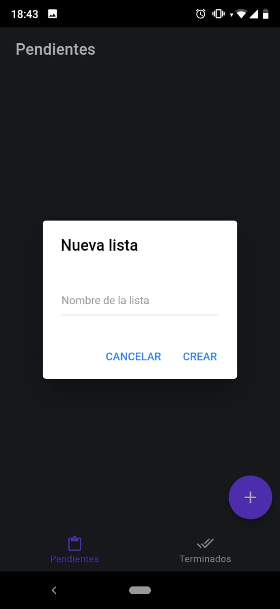
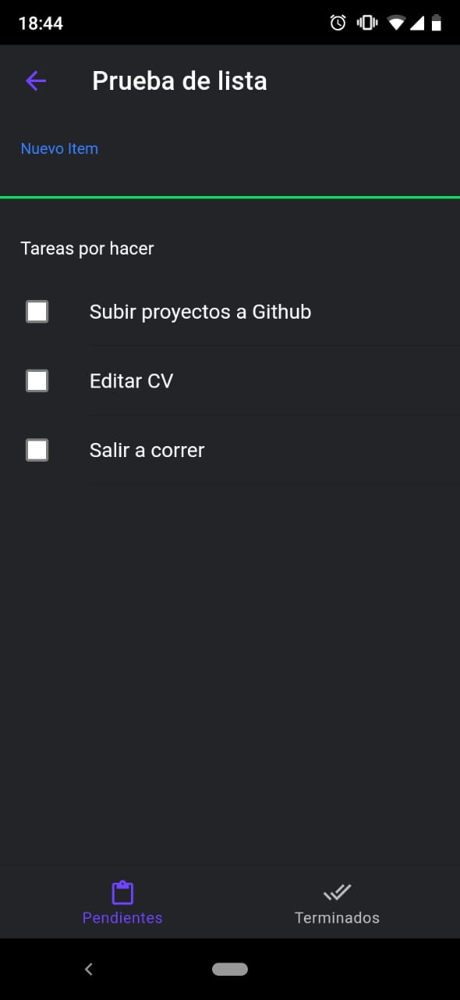
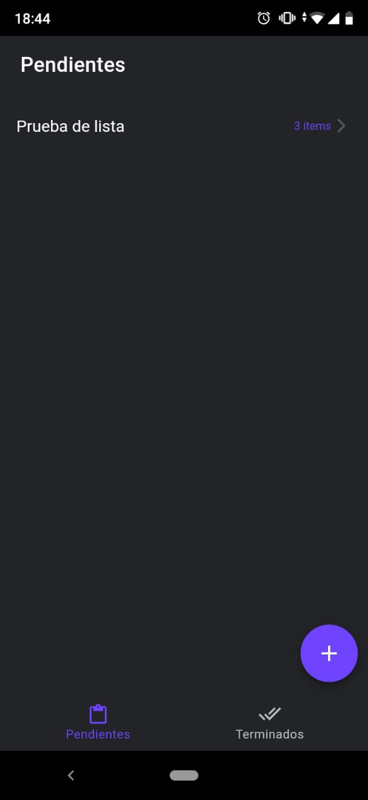
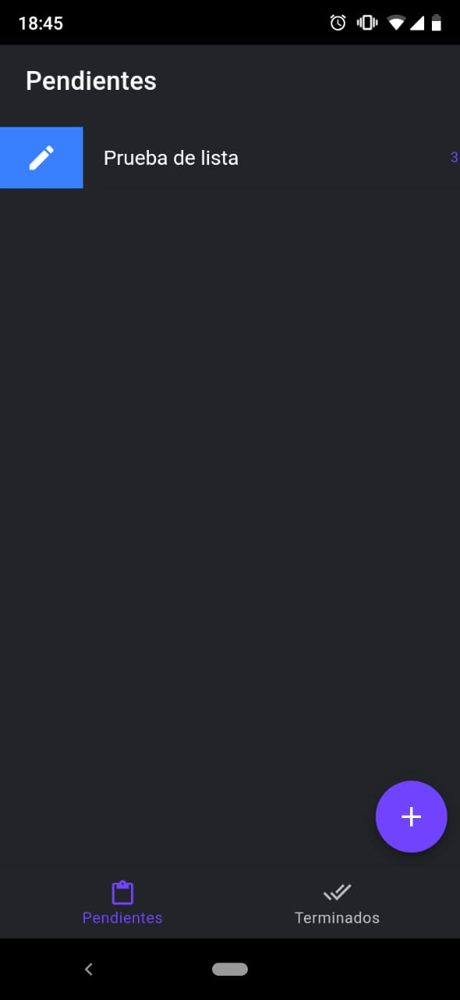
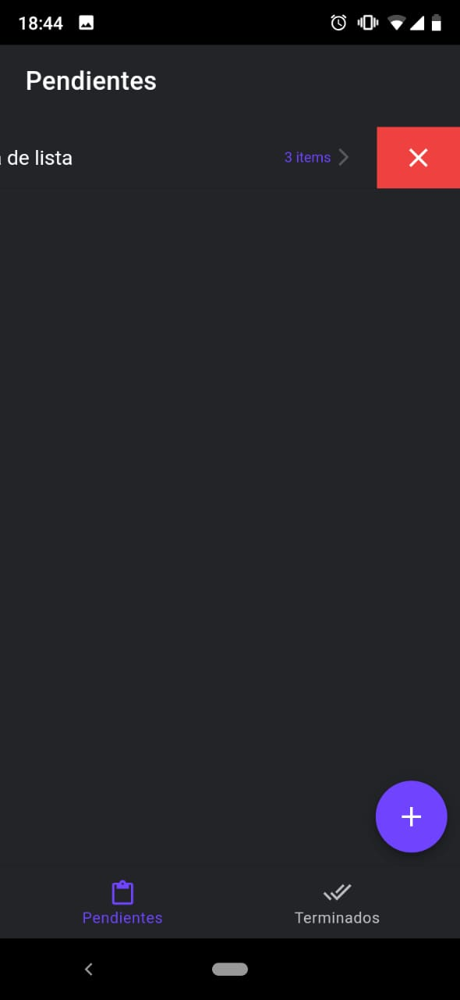
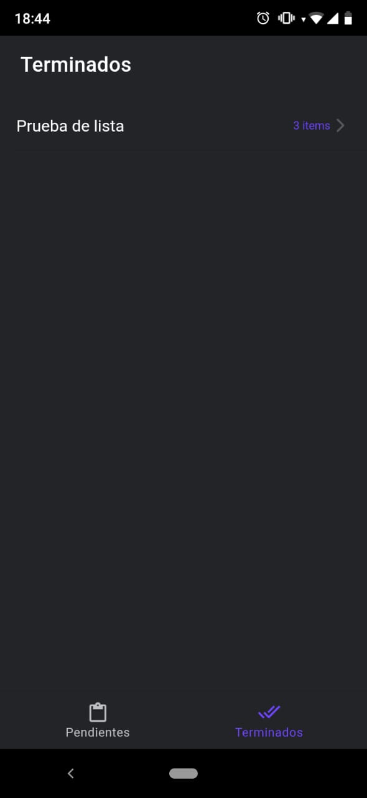
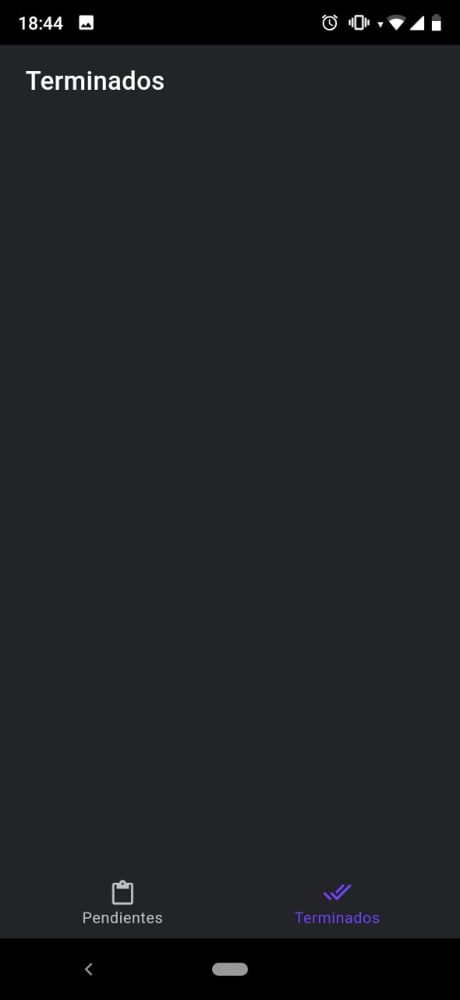

# Lista de Deseos

Esta es una aplicación para celular, la cual tambien se puede ejecutar en el navegador de computadora, creada a partir de la combinación de Angular con Ionic.
Empleandos tecnologías como HTML5, CSS3 y JavaScript.

## Vistas desde el celular

### Index
Al ingresar a la aplicación esta es la pantalla principal, sin ninguna lista:

### Asignando nombre
Al hacer click en el botón **+** se abre una ventana para asignar el nombre:

### Dentro de la lista

Dentro de una lista, se pueden realizar varias acciones. Por ejemplo agregar tareas:

Tildar o desmarcar las tareas. Eliminar tareas:

### Seccion Pendientes - Index
Con lista.
Estando en la parte principal se puede editar la lista o bien eliminarla.

#### Editar

#### Eliminar

### Seccion Terminados
Cuando se completan todas las tareas de una lista, es decir las casillas de cada tarea estan tildadas, la lista pasa a la sección de terminados.

### Seccion Terminados
Sí ninguna tarea se completó hasta el momento

## Uso:
Despues de descargar el repositorio, a traves de la linea de comando ejecutar el siguiente script:

**npm install**

para poder ejecutarlo, tienen que ejecutar el siguiente script:

**ionic serve**

# IMPORTANTE!
Si desean ejecutarlo y verlo en el celular, deben descargar la aplicacion 
[Ionic DevApp][devapp]

Y ejecutar, en vez de **ionic serve**, el siguiente script:

**ionic serve --devapp**

Tanto computadora como dispositivo móvil deben estar conectados al mismo WiFi.
Luego esperar un tiempo para que el celular se enlace y asi poder probar la App en sus celulares.

[devapp]: https://play.google.com/store/apps/details?id=io.ionic.devapp&hl=es_AR
